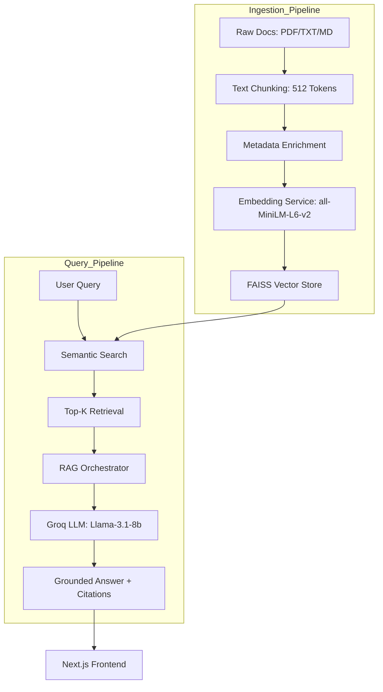

# RankSmart | Ultra-Fast AI-Powered Semantic Search & RAG

**RankSmart** is an enterprise-grade Semantic Search and Retrieval-Augmented Generation (RAG) system built for high-performance technical knowledge retrieval. By leveraging **Groq's Llama-3** models and **FAISS** vector storage, it delivers sub-second, grounded answers with verifiable citations.


---

## 🏛️ System Architecture

RankSmart operates on a multi-stage pipeline designed for accuracy and speed:



---

## 🚀 Key Features

- **⚡ Lightning Fast:** Powered by Groq for near-instant response generation.
- **📚 Multi-Format Ingestion:** Native support for PDF, Markdown, and Plain Text.
- **🎯 Precision Retrieval:** Uses dense vector embeddings for semantic understanding beyond keywords.
- **🛡️ Verifiable Answers:** Built-in Citation Manager ensures the AI only speaks based on your data and provides clickable source links.
- **🎨 Premium UI:** A high-end "HackerRank-inspired" developer interface with dark mode and glassmorphism.
- **📈 Scalable Persistence:** FAISS indexing allows for efficient searching across thousands of document chunks.

---

## 🛠️ Installation & Setup

### 1. Prerequisites
- **Python 3.10+**
- **Node.js 18+**
- **Groq API Key** (Get one at [console.groq.com](https://console.groq.com))

### 2. Backend Setup
```bash
# Activate virtual environment
python -m venv .venv
.\.venv\Scripts\Activate.ps1 # Windows

# Install dependencies
pip install -r requirements.txt

# Configure .env
cp .env.example .env
# Edit .env and add GROQ_API_KEY=your_key_here

# Start the server (with auto-reload)
$env:PYTHONPATH = "."; python src/main.py
```

### 3. Frontend Setup
```bash
cd frontend
npm install
npm run dev
```
Visit `http://localhost:3000` to start searching.

---

## 📡 API Reference

### `POST /api/v1/ingest`
Uploads files and triggers the background ingestion pipeline.
- **Multipart Form:** `files` (List of files)

### `POST /api/v1/ask`
The main RAG endpoint.
- **Query Params:** `question` (string), `k` (optional, default 5)
- **Response:** `{ answer: string, sources: Array, latency_ms: number }`

---

## ⚙️ Configuration (.env)

| Variable | Description | Default |
| :--- | :--- | :--- |
| `GROQ_API_KEY` | Your Groq API Key | (Required) |
| `CHUNK_SIZE` | Size of text chunks for indexing | `512` |
| `CHUNK_OVERLAP` | Overlap between chunks | `64` |
| `EMBEDDING_MODEL` | HuggingFace model for vectors | `all-MiniLM-L6-v2` |
| `RETRIEVAL_K` | Number of documents to retrieve | `5` |

---

## 💡 Troubleshooting

- **ModuleNotFoundError (src):** Ensure you run the backend with `$env:PYTHONPATH = "."`.
- **429 Quota Error:** Ensure your Groq API key has sufficient rate limits.
- **Hydration Error:** We've included `suppressHydrationWarning` to handle browser extensions that inject code into the HTML.
- **Lucide Icon Error:** If `Github` fails to import, we've defaulted to `Globe` for maximum compatibility across library versions.

---

Built with ❤️ by Antigravity for the Advanced Agentic Coding team.
