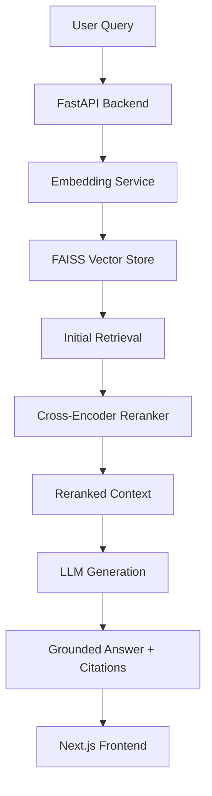

# RankSmart | AI-Powered Semantic Search & RAG

**RankSmart** is an enterprise-grade Semantic Search and Retrieval-Augmented Generation (RAG) system. It combines high-precision vector retrieval with state-of-the-art LLMs to provide grounded, cited answers from your private documents.


## 🏗️ Architecture



## 🚀 Key Features

- **Semantic Search:** Go beyond keyword matching with dense vector retrieval (`all-MiniLM-L6-v2`).
- **RAG Generation:** Grounded answers using OpenAI (GPT-4) or Anthropic (Claude 3) with strict citation rules.
- **Two-Stage Retrieval:** Initial FAISS search followed by a `Cross-Encoder` reranking layer for maximum precision.
- **Premium Frontend:** A "developer-native" UI inspired by the HackerRank/Ramotion design system, built with Next.js 14, Tailwind 4, and Framer Motion.
- **Evaluation Layer:** Integrated **RAGAS** framework to objectively measure Faithfulness, Relevancy, and Recall.
- **Dockerized:** One-command deployment for the backend and persistence layer.

## 🛠️ Setup Instructions

### Backend (Local)
1. **Clone & Install:**
   ```bash
   pip install -r requirements.txt
   ```
2. **Configure Environment:**
   Copy `.env.example` to `.env` and add your API keys.
3. **Run API:**
   ```bash
   python src/main.py
   ```

### Frontend (Local)
1. **Navigate & Install:**
   ```bash
   cd frontend
   npm install
   ```
2. **Run Dev Server:**
   ```bash
   npm run dev
   ```

### Docker
```bash
docker-compose up --build
```

## 📁 Project Structure

- `src/`: Core backend logic (Ingestion, Retrieval, RAG, LLM).
- `api/`: REST endpoints and API models.
- `data/`: Local storage for raw documents.
- `models/`: Persistent FAISS indices and local model caches.
- `frontend/`: Next.js 14 application.
- `tests/`: Automated unit and integration tests.

---

Built with ❤️ by Antigravity for the Advanced Agentic Coding team.
